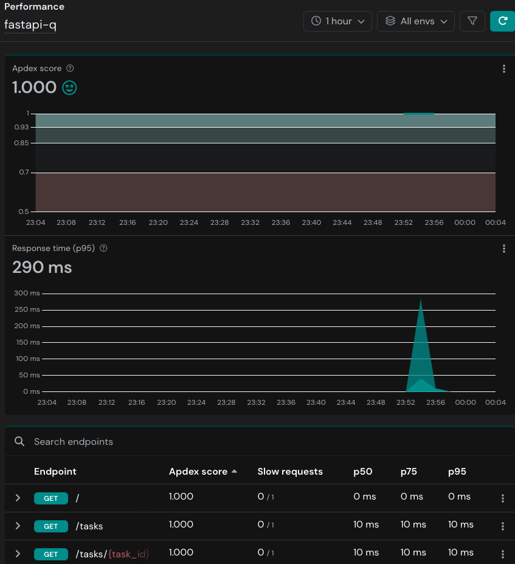
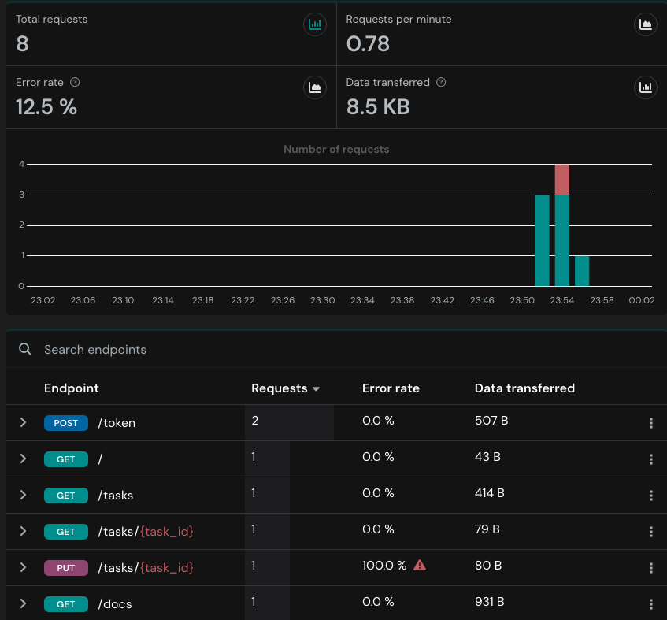
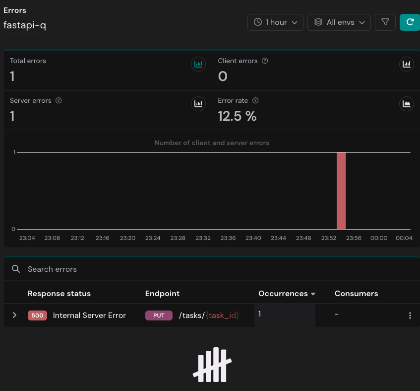

## Thank you for your time and consideration. This is a sample FastAPI implementation with JWT

## Deploying locally:
  ```
  pip install -r requirements.txt

  fastapi dev main.py
  ```
- Test API functionality in browser with `http://127.0.0.1:80/docs`.
- API endpoints uses JWT for authentication and authorization;
  - Input `username` and `password` (`john.doe`:`secure_password`) in `\token` endpoint to obtain Bearer token.
  - Input `username`, `password` and Bearer token under `client_secret` in `Authorization`.

## Deploying in Docker
```
  docker build -t fastapi_image .
  docker run --name fastapi_docker -p 80:80 fastapi_image
```
  - should be able to test API in browser as before with a different IP: `http://0.0.0.0:80/docs`.


- to run pytests:
  ```
  cd /tests
  pytest 
  ```

## Apitally for monitoring
reference: https://apitally.io/blog/fastapi-monitoring-made-easy


APItally is a simple Opentelemetry instrumentation platform to monitor API performance. Performance metrics and API calls will be passed onto the APItally dashboard after providing `client_id` in `main.py`:

```
...
api = FastAPI()
api.add_middleware(
    ApitallyMiddleware,
    client_id="client_id_given_in_apitally_account",

...
```







